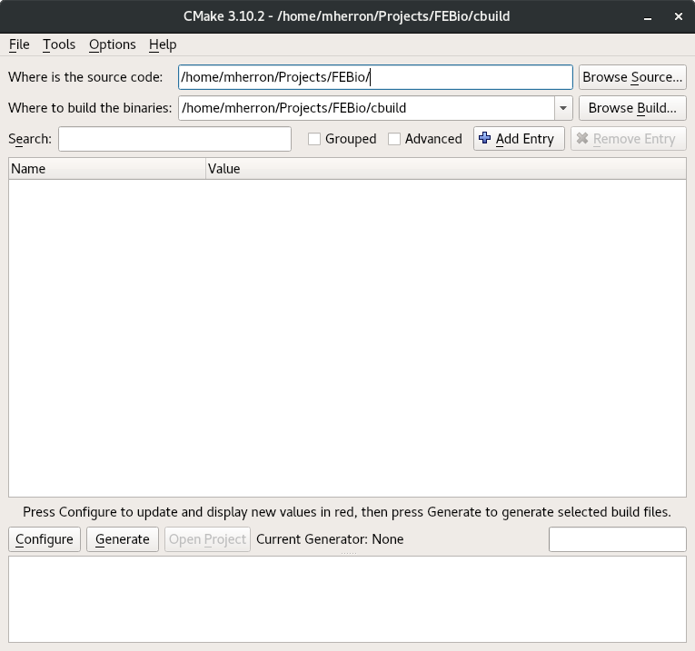
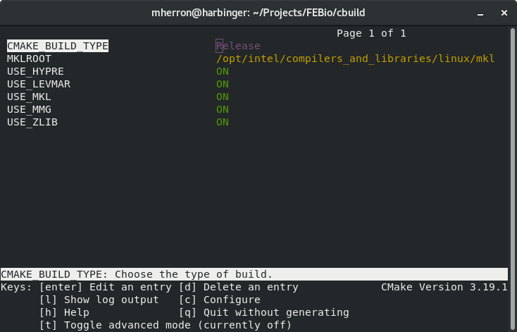

# FEBio Build Guide

### Table of contents
- [Prerequisites](#prereq) 
- [Running CMake](#runCMake)
- [Building FEBio](#build)
- [Limitations of CMake](#limits)
- [Troubleshooting](#trouble)

## Prerequisites <a name="prereq"></a>

### CMake 
FEBio's build process utilizes CMake, an open-source, cross-platform tool designed to streamline the configuration of the build environment. The CMake script in this repository will help you to locate necessary third party libraries on your machine, set up include and library paths, and allow you to choose which of FEBio’s features you would like to include in your build.

Please download the latest release of CMake from https://cmake.org/, and install it on your machine before proceeding. Many Linux distributions come with CMake pre-installed, or have CMake available through their package managers. 

### Intel Math Kernel Library

FEBio requires the Intel Math Kernel Library (MKL) in order to utilize the Pardiso linear solver and some of the iterative linear solvers. This library can be downloaded as part of the Intel oneAPI Base Toolkit from Intel's website: https://software.intel.com/content/www/us/en/develop/tools/oneapi/base-toolkit.html. In the absence of MKL, FEBio will default to using the Skyline linear solver. However, the Pardiso solver is significantly faster and more memory-efficient than the Skyline solver, and it is strongly recommended that the Pardiso solver be used.

### Additional Third Party Packages

FEBio makes use of the following third party packages to add additional functionality. If you do not need the functionality provided by a given package, you can still compile FEBio without it. The libraries below are organized according to the type of functionality they add. 

* The Lourakis levmar routine is required by FEBio in order for it to perform its parameter optimization functions. The source for this library can be downloaded from http://users.ics.forth.gr/~lourakis/levmar/.

* MMG is used in the adaptive mesh refinement framework (the FEAMR FEBio library). FEBio only uses the mmg3d component of MMG. To use this library, you will need to download the source and compile it yourself. The source for this library can be downloaded from [MMG's GitHub account](https://github.com/MmgTools/mmg).

* HYPRE is used by FEBio for the BoomerAMG iterative linear solver, which is an algebraic multi-grid solver. To use this library, you will need to download the source and compile it yourself. The source for this library can be downloaded from [HYPRE's GitHub account](https://github.com/hypre-space/hypre).

* zlib is an open-source, lossless data-compression library that is used by FEBio to optionally compress plot files to save disc space. This library is generally pre-installed on macOS, and most Linux distributions. For Windows, you will need to download the latest source from zlib's website, and compile the library yourself.

## Running CMake <a name="runCMake"></a>

CMake is used to configure the build environment for FEBio on your machine. It can be used to generate a Microsoft Visual Studio Solution on Windows, an XCode Project on macOS, and a set of makefiles to be used with the GNU Make tool on Linux. 

CMake generates a large number of configuration files that can cause the build directory to become cluttered. It is therefore strongly recommended that you do an [out-of-source build](https://gitlab.kitware.com/cmake/community/-/wikis/FAQ#what-is-an-out-of-source-build) by pointing CMake to an empty directory. The _cbuild_ directory in the FEBio repository is provided for this purpose. If for some reason you find yourself needing to clear out your CMake configuration for FEBio and start this process from scratch, all you will need to do is delete everything in that build directory.

### CMake GUI


<!--  -->

On Windows, and macOS CMake is run using the CMake graphical user interface (GUI). The CMake GUI is also available on Linux, but is generally installed separately, and so the command line interface (CLI) version, _ccmake_ is generally used (see below).

To start the configuration process, enter the path to the root directory of the FEBio repository that you've downloaded onto your machine into the box labeled _Where is the source code:_. To insure that you are doing an out-of-source build, enter the path to the _cbuild_ directory of your FEBio repository in the box labeled _Where to build the binaries:_. You may also locate these directories using a file browser by clicking on the _Browse_ buttons to the right of these fields. 

### ccmake


<!--  -->

If you are running Linux and have not installed the CMake GUI, there are two ways to run cmake. You can run the command `cmake` which will call CMake and run through the configuration and generation processes automatically. This method, however does not allow for interactivity, and so it is highly recommended that you instead run the command `ccmake`. This will run an interactive version of CMake with an in-terminal GUI as shown above. Using ccmake should allow you to follow along with the rest of this tutorial. To start an out-of-source build with ccmake, open a terminal in the _cbuild_ directory of your local copy fo the FEBio Studio repository and run the following command:

```
ccmake ..
```

### First Configuration

The configuration step in the CMake build process runs the script defined in `CMakeLists.txt` located in the root directory of the FEBio repository. This script does several things: 

* Attempts to locate MKL, and any other third party packages that FEBio Studio uses.
* Automatically enables or disables FEBio features based on which libraries it was able to find.
* Automatically sets up include and library paths for your build system based on the libraries that it found, and the features that have been enabled.

To run the configuration process click the _Configure_ button in the lower left part of the GUI, or type `c` if you are using ccmake. If you are running the CMake GUI, you will be asked to choose a generator for the project. On Windows, choose the version of MSVC that you have installed and click _Finish_. On macOS, leave the default value and click _Finish_. CMake will now run the configuration process, the output of which can be seen in the text field at the bottom of the GUI. If all goes well, new fields will be added in red to the GUI, and it should look something like the image below:


<!--  -->

After running the configuration process, the CMake GUI will populate with several build options that can be toggled on or off, each corresponding to one of the third party packages listed above. Building FEBio with a given build option enabled requires the corresponding third party packages to be installed on your machine and to be located by CMake. 

The CMake script will do its best to automatically locate these packages, but if it is unable to do so, you will have to point CMake to the packages manually for each package that you'd like to use. 

#### Manually Locating MKL

If CMake is unable to locate MKL automatically, the `USE_MKL` option will be automatically turned off. A simple mechanism is provided for you to help the script to locate your MKL installtion. A variable called `MKLROOT` will have appeared in the CMake GUI. Enter the path to the _mkl_ directory of your Intel oneAPI installation as the value for the variable, then run the configuration step again. If you've correctly entered the path, it should find the necessary components of MKL. At this point you will need to manually turn the `USE_MKL` option back on.

### Manually Locating Other Packages

If CMake is unable to find any of the other third party packages on your system, it will automatically disable the corresponding build option. It will also make visible the fields for the include and library paths for the missing packages. In order to build with any of these options, you will need to manually edit the include and library paths for the required packages. The include path for a given package should point to the directory containing that package's header files, and the library path should point to the library file. Once you have updated the paths for the required packages, you then need to manually toggle the option back on.

### Project Generation

Once the desired optional packages have been located, and their corresponding build options have been enabled, it is time to generate the platform-specific build files. It's always a good idea to run Configure one more time before you generate the build files. This will make sure that the CMakeLists script catches any errors that you may have introduced by manually changing paths, or toggling build options. Once you've run Configure again, click the _Generate_ button (or type `g` if you're using ccmake). On Windows this will generate a Visual Studio Project, on macOS this will generate an XCode Project, and on Linux this will generate a Makefile. If you're running Windows or macOS, you can click the _Open Project_ button and it will automatically open the created project. 

## Building FEBio <a name="build"></a>

### Windows

Once you have the Visual Studio project open, you can choose whether you'd like to build a debug or a release version of the software, and then start the build process by either clicking on the Play button, or by pressing _F5_. After a successful build, the software should launch automatically. 

### macOS

Once you have the XCode project open, you'll want to change the build target from `ALL_BUILD` to `FEBio`. Do this by clicking on the button that says `ALL_BUILD` in the upper left corner of XCode, next to the Play and Stop buttons. XCode will fully build FEBio with either target selected, but this will ensure that XCode will automatically launch FEBio after it's been built. Then you can start the build by either click on the Play button, or by pressing ⌘R. After a successful build, the software should launch automatically. 

### Linux

Once the Makefiles have been generated, open a terminal in the _cbuild_ directory, and run `make`. If your machine has multiple cores, you can increase the speed of the build by passing a `-j` flag to _make_, followed by the number of threads you want _make_ to use (e.g. `make -j4`). Please note that this will only increase the speed of the build, and will in no way affect the final binary. After a successful build, the compiled binary can be found in the _bin_ subdirectory.

## Limitations of CMake <a name="limits"></a>

CMake is a useful tool for automating cross-platform builds, but it is not without its limitations:

* CMake is unable to create project files or makefiles that can automatically detect the presence of new source files. If you update your local repository after a new FEBio release, or if you modify FEBio's source and add new source files, you will have to rerun CMake in order to insure that any new source files are included in the build.

* On Linux, the type of build (e.g. debug, release, etc) is determined by CMake during the generation process, since the related options are baked into the resulting makefiles. To change the type of build you are building, you must rerun CMake and select the desired build type. 

## Troubleshooting <a name="trouble"></a>

* If you get errors that look something like this<br><br>Could not find HYPRE library. Check HYPRE_LIB.<br><br>This means that  CMake is unable to locate the library associated with a currently active build option. To fix this issue, ensure that the CMake variable for that package's library is pointing to the correct location on your machine, and that the library file exists in that location. If CMake is still unable to find the required library, you may either have to rebuild or reinstall the third-party package, or disable the build option that uses it. 

* If you run into other issues while building FEBio, please visit [our forums](https://forums.febio.org/) for more help.
